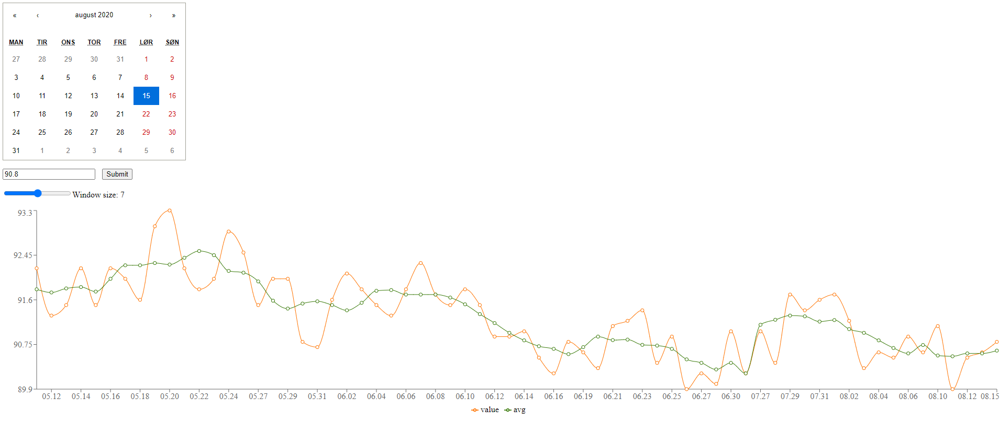

# Time Series Tracker

App to create and visualize a time series.

## Requirements

[npm](https://www.npmjs.com/get-npm)

The app has only been tested in Google Chrome browser.

## Installation

1. Clone the repo
2. Navigate to root folder
3. Run npm install:

```bash
npm install
```

## Usage

Run:

```bash
npm start
```

Open you browser on http://localhost:4242

Click on the calendar to select date, enter a value for your selected date and submit. A moving window average will be recalculated when a new value is inserted. You can select the size of the window (number of days) with the slider.



## Information

The app uses server side rendering. All data you input is saved on your machine to <repo_root>/src/server/data/time_series.json
